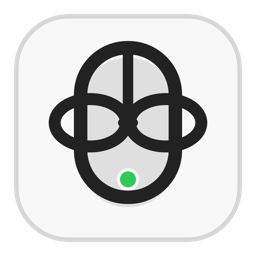

# No Barrier Mouse

<p align="center">
  
</p>

<p align="center">
  <strong>One mouse. Two Macs. No barrier.</strong>
</p>

<p align="center">
  
</p>

A tiny macOS menu-bar app for sharing one mouse and keyboard between two Macs on the same local network.

## Requirements

- macOS 10.15 or newer
- Xcode Command Line Tools
- Accessibility permission on both Macs
- Input Monitoring permission on the controller Mac
- Local Network permission if macOS asks for it

## Build

Build the app for the current Mac:

```sh
./build-app.sh
```

Build the Intel app from an Apple Silicon Mac:

```sh
./build-app.sh intel
```

The app bundles are created in:

```text
.build/release/NoBarrierMouse.app
.build/release/NoBarrierMouse-Intel.app
```

## Use

1. Open No Barrier Mouse on both Macs.
2. Choose `Controller` on the Mac with the physical mouse and keyboard.
3. Choose `Receiver` on the Mac you want to control.
4. Grant Accessibility permission on both Macs.
5. Grant Input Monitoring permission on the controller Mac.
6. Move through the controller's right screen edge to enter the receiver.
7. Move through the receiver's left screen edge, or press `Esc`, to return.

If the cursor moves but clicks or scrolling do not work, remove the old No Barrier Mouse entry from Privacy & Security, add the current app again, then reopen it.

If mouse and clicks work but the keyboard does not, grant Input Monitoring permission on the controller Mac, then quit and reopen No Barrier Mouse.

## Release Strategy

No Barrier Mouse uses Release Please with Conventional Commits for official GitHub Releases.

Use commit messages like:

- `feat: add clipboard sharing`
- `fix: reduce cursor delay`
- `docs: update install notes`

After changes land on `main`, Release Please opens or updates a release PR. Merge that PR when you are ready to publish. The release workflow then creates the GitHub Release and uploads the app bundles.

Each release contains only:

- `NoBarrierMouse-X.X.X-macOS.zip`
- `NoBarrierMouse-X.X.X-macOS-Intel.zip`

## Notes

The app is unsigned and not notarized by default. macOS may require right-clicking the app and choosing `Open` the first time.
